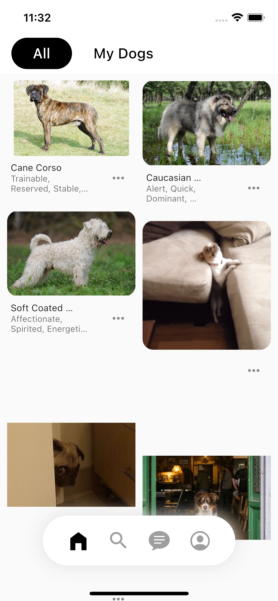
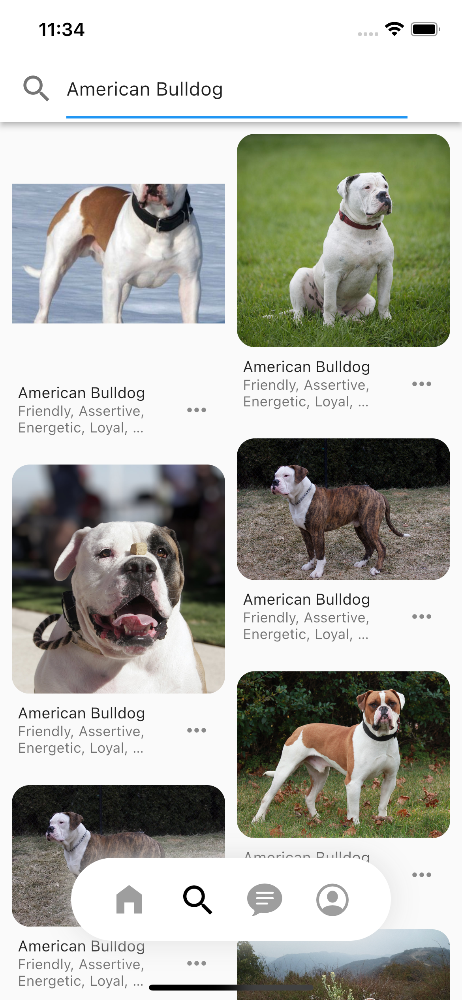

# Flutter dog application
A small attempt to make an Dog app for learning manner.

## 🤓 Author(s)
**Mr Akrom Akhmadjanov** 

## ScreenShots
### Home Page

### Search page
 &nbsp;&nbsp;&nbsp;&nbsp; 

### Favourite page
&nbsp;&nbsp;&nbsp;&nbsp; 

### Vote page
&nbsp;&nbsp;&nbsp;&nbsp; 

### Upload page
&nbsp;&nbsp;&nbsp;&nbsp; 

## ✨ Requirements
* Any Operating System (ie. MacOS X, Linux, Windows, iOS, Android)
* Any IDE with Flutter SDK installed (ie.  Android Studio, VSCode, IntelliJ, etc)
* A little knowledge of Dart and Flutter
* A big brain to think like real developer

